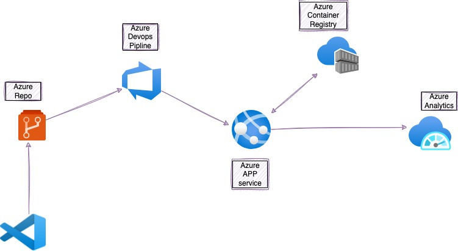

# Overview

Welcome to Toy Robot Challenge! This simple web application allows users to control a virtual toy robot through a web interface.

## Diploying on local machine:

Follow these instructions to set up and run the Flask Toy Robot Challenge on your local machine.

### Prerequisites

- Python 3.x
- Flask
- Waitress

### Installation

1. Clone the repository:

    ```bash
    git clone https://github.com/harshahadu/harsha_robot.git
    ```

2. Navigate to the project directory:

    ```bash
    cd harsha_robot
    ```

3. Install dependencies:

    ```bash
    pip install -r requirements.txt
    ```

4. Start toy robot program:

    ```bash
    python app.py
    ```

5. Open your web browser and go to [http://localhost:5000].

   You will see the web interface to control the toy robot. Use the provided buttons and controls to move the robot.

## Diploying on local machine with Docker:

Follow these instructions to set up and run the Flask Toy Robot Challenge on your local machine with Docker.

### Prerequisites

- Docker Desktop must be installed
- Docker must be connected to Docker hub.

### Installation

1. Clone the repository:

    ```bash
    git clone https://github.com/harshahadu/harsha_robot.git
    ```

2. Navigate to the project directory:

    ```bash
    cd harsha_robot
    ```

3. Build a docker image with Dockerfile:

    ```bash
    docker build --tag harsha_robot .
    ```
4. Run the image locally in a Docker container:

    ```bash
    docker run --detach --publish 5000:50505 harsha_robot
    ```
5. Access the application with the given url:

     http://localhost:5000 

### Usage
Now you will have to position the robot on the table-top using x,y coordinates and position value.
- **Enter x value**: You are allowed to enter a value between 0 to 4.
- **Enter y value**: You are allowed to enter a value between 0 to 4.
- **position**: You will only have four possible positions to choose ['NORTH','SOUTH','EAST','WEST']
Once the above requirements are satisfied you can place the robot on the table-top by clicking on the button place.

Now the robot is placed on the table-top and you can use the action menu placed at the botom of the table to control your robot.


## Diploying on Azure Devops using Azure Pipeline:





The azure-pipeline.yaml contains a continuous integration and deployment (CI/CD) pipeline using Azure DevOps. The pipeline is configured to trigger on changes to the main branch.


There are 5 stages defined in the azure-pipeline.yaml to deploy the web application in the Production server.

Stage 1: This stage is to test the app logic, here we set up the Python environment, install the dependencies and run the pytest.

Stage 2: This defines the Build stage, we use docker to build and push the Docker image to Azure Container Registry (toyrobotapp) and Build development environment stage.

Stage 3 : This stage is to build the Infrastructure using Ansible using app-create.yml and therefore, we have to install Ansible and Ansible Azure Collection and run the playbook app-create.yml.

Stage 4: This stage is for the Deployment to Development stage and deploy the Docker image to the Azure Web App (harshatoyrobot).
Stage 5 : This stage test the Application's Health.

